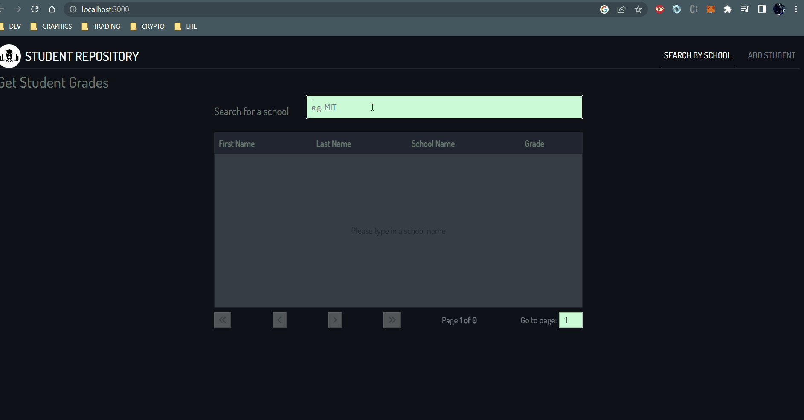
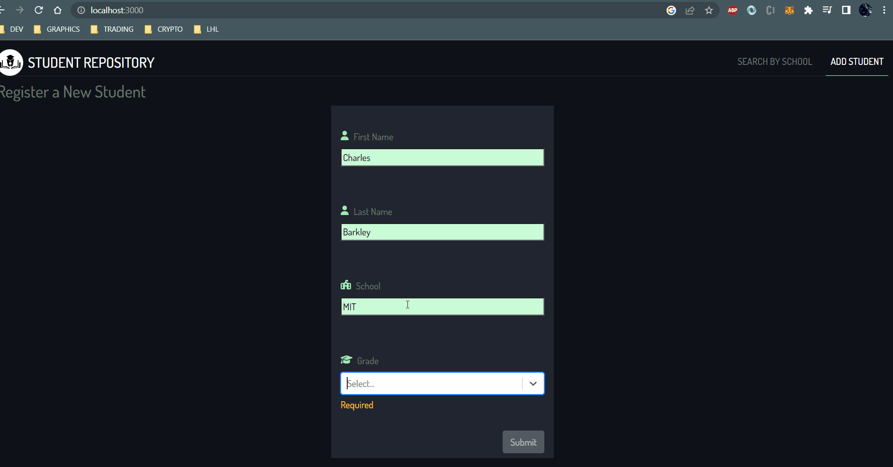

# Student Grades

## Description
A sample fullstack app designed to register student grades and search all student's grades by school. A PDF file can also be generated with the search results.
#

## Getting Started
- Clone this repo

- Install dependencies for client
    ```
    cd api && npm i
    ```

- Start client
    ```
    npm start
    ```

- Install dependencies for api
    ```
    cd client && npm i
    ```
- Create target database in postgres
    ```
    sudo -u postgres psql
    create database grades;
    ```
    
- Start api server 
    ```
    nest start --watch
    ```

- Once api server is live, view api doc [here](http://localhost:3001/api#)
#

## Preview
 &nbsp;

